# R1 Identification of the problem you are trying to solve by building this particular app.

This Project is for users who want to make tasks and store tasks, it can be used for individuals and organisations. It is intended for people who like to write down a bunch of tasks, so they can keep track of were they are up to.

The application allow users to create and retrieve task as well as let then know when they created it at and when there due date of the task is. Organizations that have alot of work can become disorganize and stressed with alot of tasks.

Individuals can struggle with keeping track of their tasks, especially when they have alot to do, which can lead to forgotten task or missed deadlines for jobs or every day task.

# R2 Why is it a problem that needs solving?

Modern day is a very fast-paced work environment, it is important to stay organized and on top of task. But with so many task to manage, it can be easy to become overwhelmed, which is where a task management system comes in.

Individuals or teams can use a tasks management system so they can have organization in their work load and be able to piroritize tasks to make sure no task is left behind or forgotten. With all tasks in a single place team or individuals can see what need to be done and when, which help remove stress load and to be able to mange their time.

One key benefit if a task system is to improve collaborations. which can help team stay on the same page and make sure everyone is working towards the same goal, it can improve productivity, and make teams and individuals work more efficiently and effectivly. 


# R3 Why have you chosen this database system. What are the drawbacks compared to others?

For my API webserver project i have choosen postgreSQL database management system.

I choose this database system because, PostgreSQL supports both relational and non-relational tables and because it is compatible with Python, Flask, and other third-party softwares like SQLAlchemy, Marashmallow, and JWT that are used in my application, it follows the ACID compliance for the project.

PostgreSQL has an open source, meaning its free to use and has a long history, with large communitys that provides sample resources and documents. It's also got high level security measures, which support User authentications and authorizations and it's able to hash for a one-way encryption of passwords.

Some drawbacks of postgreSQL is it can be more complex to set up and maintain.
For very large-scale application that require high levels of scalabilty postgreSQL may not be the best choice. PostgreSQL

https://www.guru99.com/introduction-postgresql.html

# R4 Identify and discuss the key functionalities and benefits of an ORM

An ORM known as an Object-Relational Mapper, which is a software that translates bewteen data representations used by databases and those used in object-oriented programming(OOP). It also a tool that allows developers to write their code prgramming language that are more knownledgeable instead of SQL to perform on the database. 

Key functionality of in ORM is that it allow developer to map object or models within a relational database. Column in a models class are defined in the database table example (/src/models/) have files like user.py, task.py, and comment.py. ORM can also define the relationship bewteen theses models or objects (one-to-one, one-to,-many, many-to-many).

Some key benefits of an ORM are:

- Database abstraction: Which make applications independent of the databsae system being used by the backend.

- Increased developer productivity: The hassle from the codes are reduced to learn SQL syntaxs, they can move the focus on optimizing code and performance can be improved.

- Flexibility: Small or big chnage can be carried out via ORM, there is no restrictions on how developer deal with their data, a single cell in the databse can be retrieved changed and saved back.

- Robustness and security: Connections can become robust, secure as there will be less intervention in a code. It handles all necessary configurations that is required to map applictions.

https://www.baeldung.com/cs/object-relational-mapping

https://www.educba.com/what-is-orm/

# R5 Document all endpoints for your API

Endpoint in my API project are in the following format:

**Route: "/"**
- Methods: 
- @decorator
- Functionality
- Local host URL
- Example expected response

**The Local Host URL that I used was localhost:8080/**

# **AUTH ENDPOINTS:**


**URL prefix "/auth"**

**Route: "/register"**

- Method: POST
- @auth_bp.route('/register', methods=['POST])
- Functionality: Creates a new user, is_admin will return True , if there not admin it will return False.
- Local host URL: localhost:8080/auth/register
- Examples of expected response (user without admin):

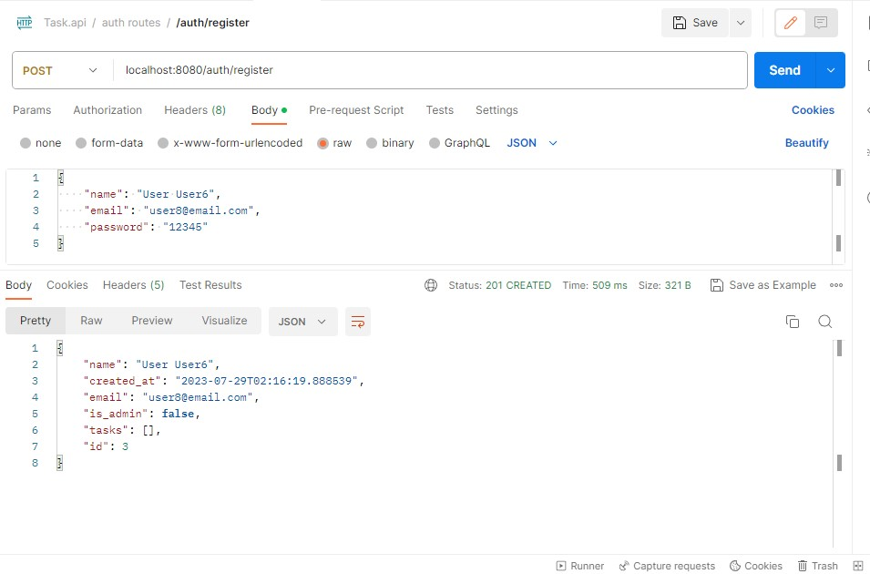


**Route: "/login"**

- Method: POST
- @auth_bp.route('/login', methods=[POST])
- Functionality: Allow a user to login and recieve there token only require 'Name', 'email', and 'password'.
- Local host URL: Localhost:8080/auth/login
- Example of login and there response(without admin):

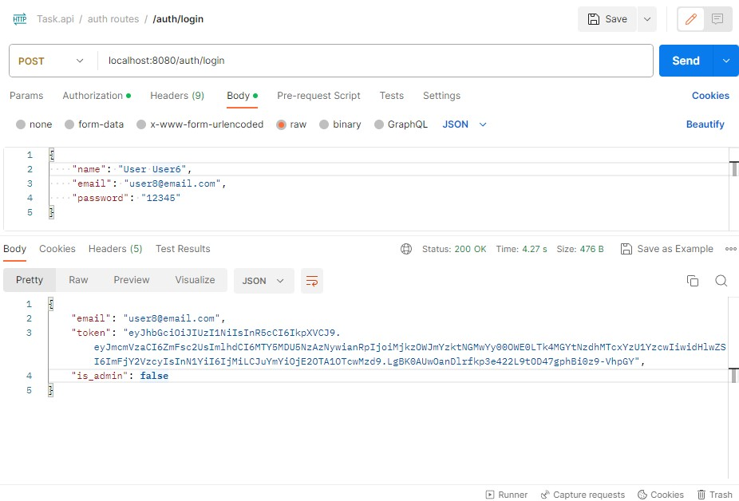

- Example of admin login and it response:


# **USERS ENDPOINTS**


**URL prefix '/users'**

**Route: '/'**

- Method: GET
- @user_bp.route('/', methods-['GET])
- Functionality: Return a list of users and how many task they have
- Local host URL: localhost:8080/users
- @jwt_required 'token'
- Example of getting all users and the response

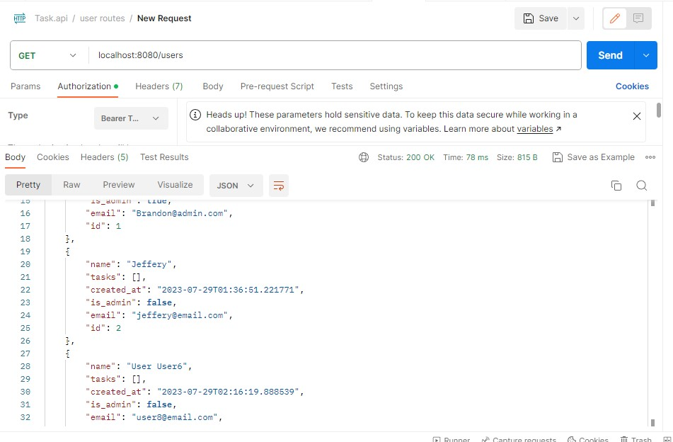

**Route: '/int:user_id'**

- Method: GET
- @user_bp('/<int:user_id>', methods=['GET])
- Functionality: Returns a single user with specified id given
- Local host URL: localhost:8080/users/int:user_id
- @jwt_required 'token'
- Example of single users with response:

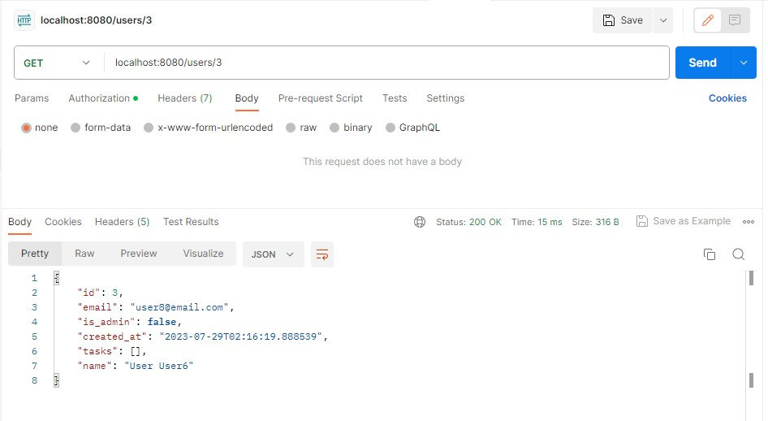

**Route: '/int:user_id'**

- Method: DELETE
- @user_bp.route('/<int:user_id>', methods=[DELETE])
- Functionality: Deletes a user with specified id
- local host URL: localhost:8080/users/int:user_id
- @jwt_required 'token'
- Example of user being deleted and response:

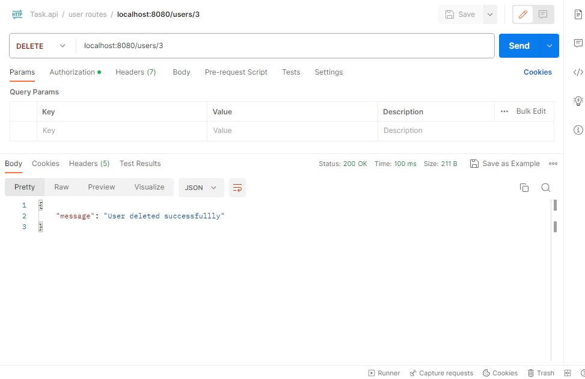

# **TASKS ENDPOINTS**


**URL prefix: '/task'**

**Route: '/'**

- Method: GET
- @tasks_bp.route('/', methods=['GET'])
- Functionality: Gets all users in db
- local host URL: localhost:8080/task
- @jwt_required 'token'
- Example of getting all task and response:

Example 1:
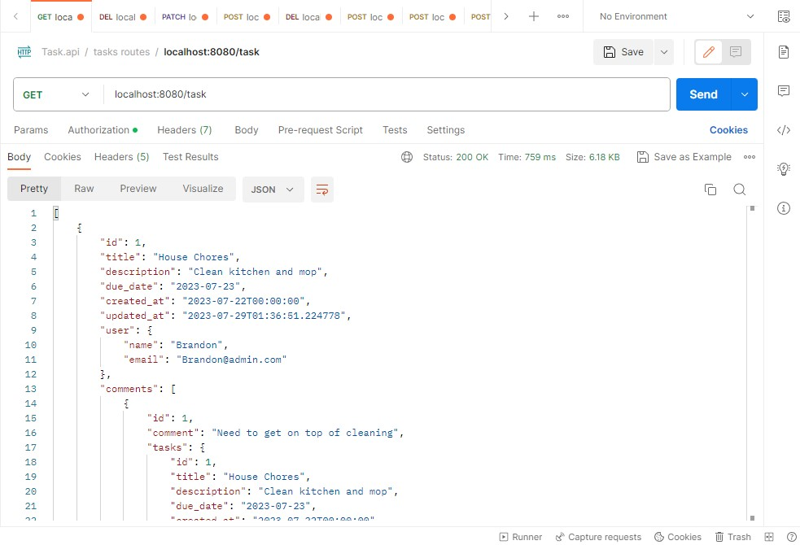

Example 2:
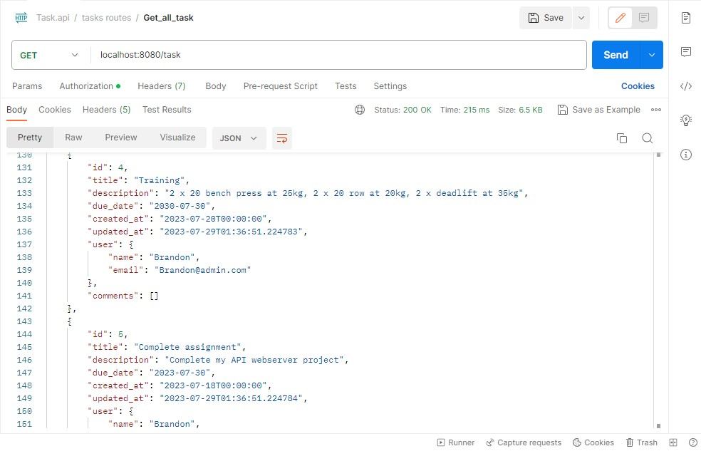

Example 3:
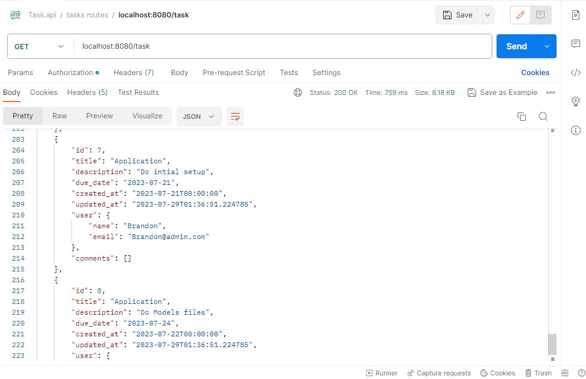

**Route: '/<int:id>'**

- Methods: GET
- tasks_bp.route('/<int:id>', methods=['GET'])
- Functionality: Gets a single user with specified id given.
- local host URL: localhost:8080/task/tasks_id
- @jwt_required 'token'
- Example of getting single task and response;

**Task 1:**
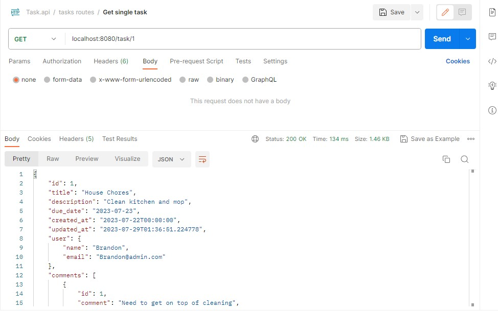

**Task 2:**
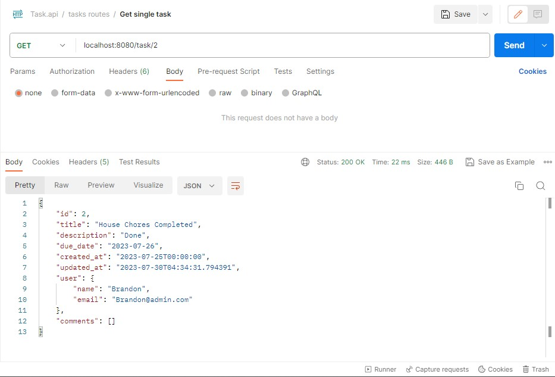

**Task 6:**
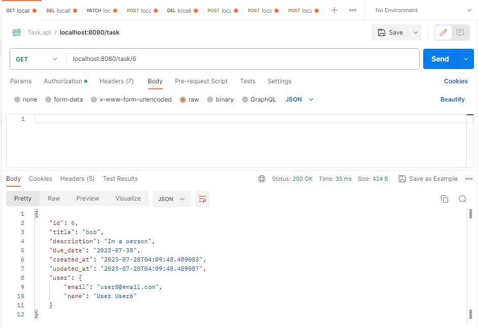

**Route '/**

- Method: POST
- @tasks_bp.route('/', methods=['POST])
- Functionality: Creates a task
- local host URL: localhost:8080/task
- @JWT token requried
- Example of creating a task and the response:

Example 1:
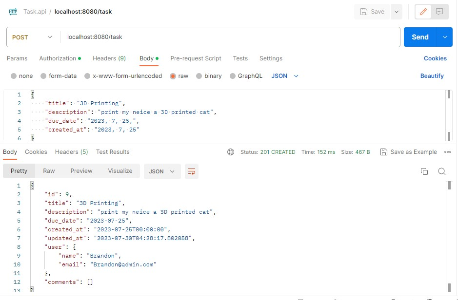

Example 2:
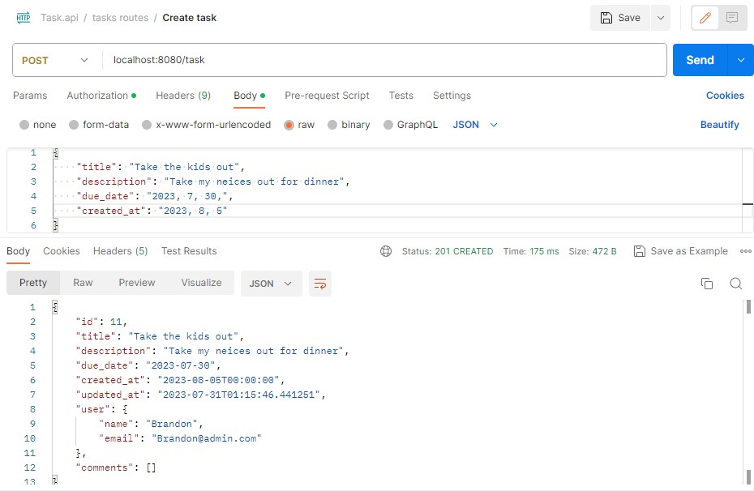

**Route '/id'**

- Methods: DELETE
- task_bp.route('/<int:id>', methods=[DELETE])
- Functionality: Deletes a task with the specified id given
- local host URL: localhost8080/task/task_id
- @jwt_required
- Examples of deleting a task:

Example:
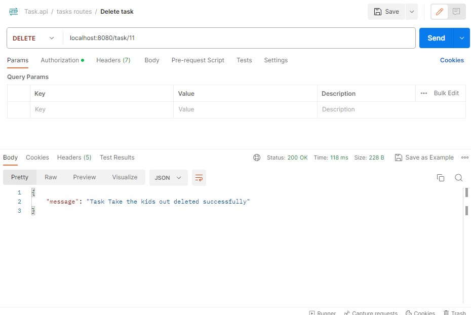

**Route '/id'**

- Methods: PUT, PATCH
- Functionality: Updates a task
- local host URL: localhost:8080/task/task_id
- @jwt_required 'Token'
- Example of updating task and response:

Example 1:


Example 2 when you look at all task again:


# **COMMENT ROUTES**


**URL prefix: '/tasks/int:task_id/comments**

**Route '/'**

- Method: POST
- Functionality: Creates a comment on a users task or their own
- localhost URL: localhost:8080/task/task_id/comments
- @jwt_required 'Token'
- Example of creating a comment:

Example:
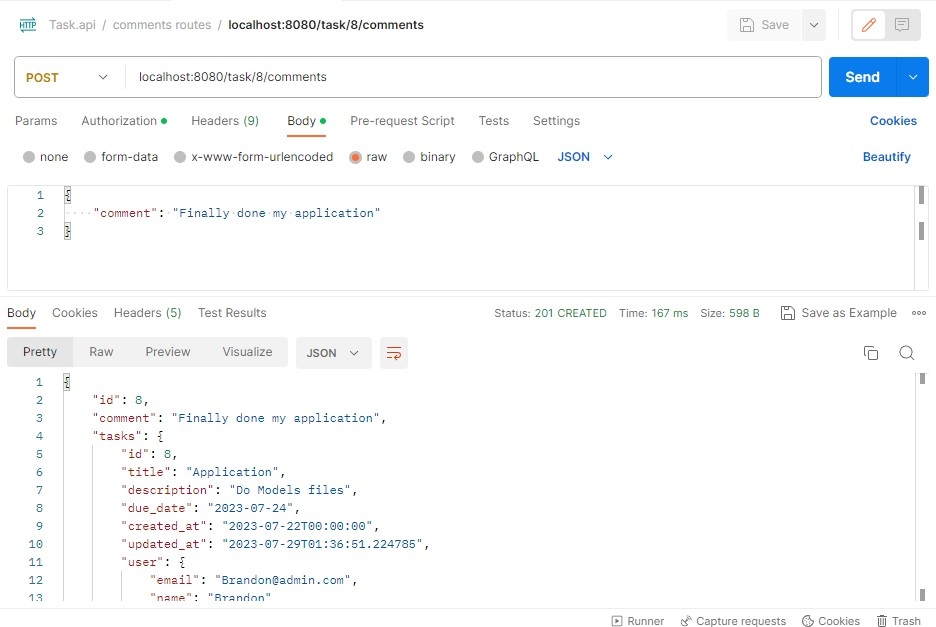

**Route '/int:comment_id'**

- Methods: PUT, PATCH
- Functionality: Updating a comment
- localhost:8080/task/task_id/comments/comment_id
- @jwt_required 'Token'
- Example of updating comment:

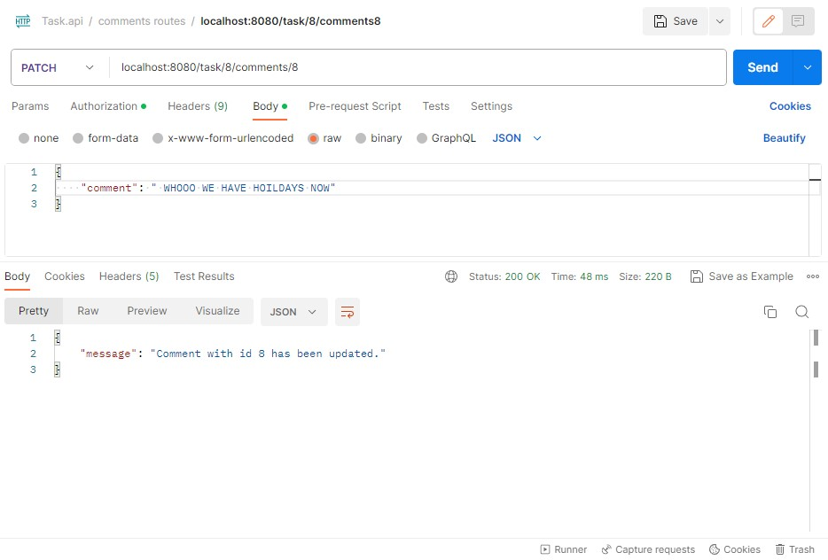

**Route: '/int:comment_id'**

- Method: DELETE
- Functionality: Deleteing a comment
- local hosat URL: localhost:8080/tasks/tasks_id/comments/comment_id
- @jwt_required 'Token'
- Example of deleting comment:

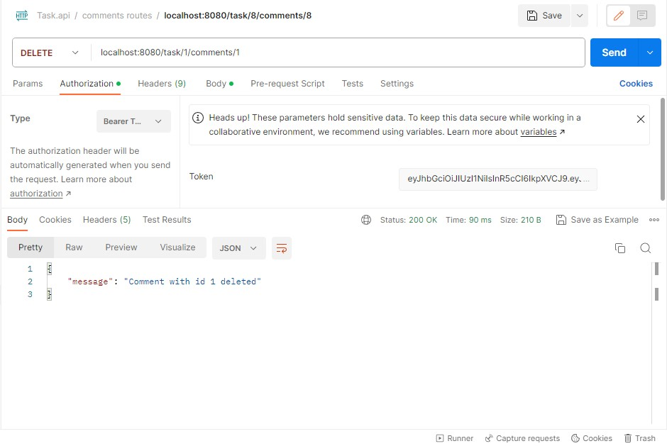

# R6 An ERD for your app


# R7 Detail any third party services that your app will use

**Flask:**

- Flask is a web application framework that makes it easy for developer to build a web applications and RESTful web services. Flas is bason on the Werkzeug WSGI toolkit and also uses Jinja2 template engine. It's a mirco framework that provides features to assist development without need to worry about low level details. Which make it a good choice for small to medium sized web applications.

**SQLAlchemy**

- SQLAchemy is a Python library and a ORM(Object Relational Mapper) that provides a high level abstraction with itneracting with databases using SQL. It's been used in this application to map defined models to tables on the database. SQLAlchemy is used with Flask-SQLAlchemy, and extension for flask that adds supports bewtten Flask and SQLAlchemy.

**Marshmallow**

- Marshmallow is also an ORM library. the process of seialising and deserialising Python objects. It also used to convert object to and from python data types. Marshmallow uses a schema to define and validate input data, and convert the input data to JSON string, and serialising the JSON string back to native Python types. It's used in conjunction with Flask-Marshamllow, a flask extension.

**JSON Web Tokens(JWT)**

- JWT is an open standard for securely transmitting information between parties as a JSON object through the use of a digital signature. It has been used in this application for authorisations and authentications.JWT, once a user has logged in a token is created and each subsequent request will read the token allowing user to access the routes and perfom the methods.

**Bcrypt**

- Bcrypt is a password-hashing function designed by Niels Provos and David Mazieres, based on the Blowfish cipher and presented at USENIX in 1999. Bcrypt has been used in my application to hash and salt passwords for secure storage in the database.

**Postman** was used to test my API endpoints functiionality

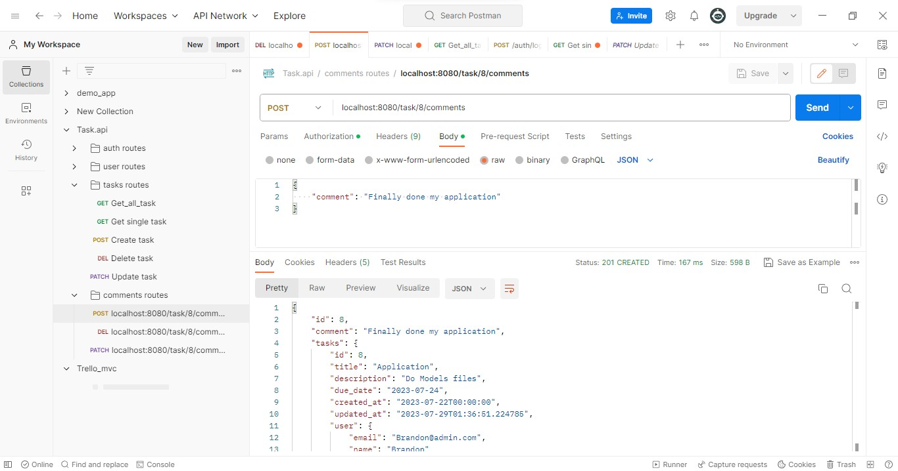

https://www.postgresql.org/

https://jwt.io/introduction

https://en.wikipedia.org/wiki/Bcrypt

https://flask.palletsprojects.com/en/2.1.x/

https://werkzeug.palletsprojects.com/en/2.1.x/

# R8 Describe your projects models in terms of the relationships they have with each other

The models in my project are User, Task, Comment found in file /src/models folder, the relationship and data have been defined with SQLAlchemy(db.model)

**User model:**

A User must register with thier name, email and password and then they can login with that to access my API. Once logged in they can create a task read task and make comment on theirs or other peoples tasks.

```
class User(db.Model):
# Define the table name
__tablename__ = 'users'
      
    # Sets the primary key for user
    id = db.Column(db.Integer, primary_key=True)

    # Defines the columns of the users table
    name = db.Column(db.String(50), nullable=False)
    email = db.Column(db.String(100), nullable=False, unique=True)
    password = db.Column(db.String(200), nullable=False)
    created_at = db.Column(db.DateTime, default=datetime.utcnow)
    is_admin = db.Column(db.Boolean, default=False)
```

-  ```__tablename__ ```  = users, defines the column name and data type and constraints.

- id column is defined as an integer primary key which increment through every new creation of a new user..

- Name, email, password and is_admin is defined as a string() or boolean set, they have the nullable= clause.

- is_admin will revert to false if a user does not a authorised as admin.

- **Relationships:**
    - User:
       - one to many relationship with task
       - One to many relationship with comment
       - many to many relationship, many users can leave many comment on a certain task

**Task model:**

task.py

```
class Task(db.Model):
    # define table name for db
    __tablename__ = 'tasks'
    # Set the primary key
    id = db.Column(db.Integer, primary_key=True)

    # Other attributes
    title = db.Column(db.String(50))
    description = db.Column(db.Text)
    due_date = db.Column(db.Date, nullable=False)
    created_at = db.Column(db.DateTime, default=datetime.utcnow)

    # Set foreign key for user_id
    user_id = db.Column(db.Integer, db.ForeignKey('users.id'), nullable=False)

    # Relationship with other models
    comments = db.relationship('Comment', back_populates='tasks', foreign_keys=[Comment.task_id])
    user = db.relationship('User', back_populates='tasks', lazy='joined')
```
- __Tablename__= task, defines the table name to be mapped in model

- id = db.Column(db.Integer, primary_key=True) creates a column with the title 'id' of an integer data type, will also auto increment with each new tasks.

- Title and description is established wth their data type character limit (string() or Text())

- due_date and created_at is defined with date due_date you write you due_date in (year, month, day) and created_at is defined and automated time from when you created the task.

- **Relationship**
     - one to many relationship with comment model
     - many to one relationship wiht User model

db.relationship function as argument like back_populates, foregin_keys and lazy.

**Comment model**

comment.py

```
class Comment(db.Model):
    # Table name
    __tablename__ = 'comments'

    id = db.Column(db.Integer, primary_key=True)
    comment = db.Column(db.Text)

    user_id = db.Column(db.Integer, db.ForeignKey('users.id'), nullable=False)
    task_id = db.Column(db.Integer, db.ForeignKey('tasks.id'), nullable=False)

    user = db.relationship('User', back_populates='comments')
    tasks = db.relationship('Task', back_populates='comments')
```

- _ tablename _ = 'comment is the databe tables name.

- id = db.Column(db.Integer, primary_key=True) creates a column  with the title id of a interger data type.

- Comment class also has two forign key attributes user_id and task_id which reference the id attribute of the user and tasks tables. theses foreign keys establish relationships between the comment, user and task classes.

- Each comment is associated with one user.

- Each user can have many comments.

- Each comment is associated with one task.

- Each task can have many comments

# R9 Discuss the database relations to be implemented in your application

**User relationship**

- User has an id of an intger data type with a primary key.
- User table has a one to many to task for one user can have multiple task
- User has one to many relationship with comment so one user can have multiple comments

**Task Relationship**

- Task has a id of integer with the same primary key
- Task has a relationship, one to many to comments one task can have many comments
- It aslo has a foriegn key user_id which when they create a task they can there user.id

**Comment Relationship**

- Comment has a primary key of 'id' which references the id column in users and tasks tables.
-  User and tasks relationship is defined by using db.relationship function.
- Defining a many to many relationship where users tasks can be associated with multiple tasks and each tasks can be associated with multiple users.

# R10 Describe the way tasks are allocated and tracked in your project

Pior to the project i needed to come up with an idea and get aprroved:

> My API project is a task management system, users can create a task, read it, update the task as well as delete task once they are done.

> Eductor came back and said: Hey Brandon, nice idea, but the database structure may be not complex enough. We usually require at least one many-to-many relationship. In your app, this can be done, for example, if users can leave comments on other users' tasks, do you think this is something you would like to do? There is some room for more normalisation. Are users able to update themselves?

Sadly i didnt use trello but if i did, i would of made three column with to do, in progress and done.

List of step outs of how wouldve track my task.

- **Get approved for my project**

- **Set up virtual environment**

    - Download all third partys

- **CLI Commands**

    - Flask db drop
    - Flask db create
    - Flask db seed

- **Set up main.py**

- **Set up user table and controllers**
    - GET (ALL)
    - GET (id)
    - DELETE (id)
    - Auth Register (POST)
    - Auth Login (POST)
    - User_Schema

- **Set up Task table and controllers**
    - GET (id)
    - GET (ALL)
    - POST (Create)
    - DELETE (id)
    - PUT, PATCH (Update)
    - Task_schema

- **Set up Comment table and controllers**
    - POST (Create)
    - DELETE
    - PUT, PATCH (Update)
    - Comment_schema

- **Permissions**
    - Set up JWT Token

- **Documentation**
    - Completed readme R1-10

https://github.com/JRBoland/JamesBoland_T2A2/tree/main#req3 ( i liked his lay out)

Some code i used for help with API Project:

https://docs.sqlalchemy.org/en/14/core/type_basics.html#sqlalchemy.types.DateTime.python_type
https://stackoverflow.com/questions/48592639/updating-a-record-with-wtforms-sqlalchemy-flask
https://stackoverflow.com/questions/6699360/flask-sqlalchemy-update-a-rows-information